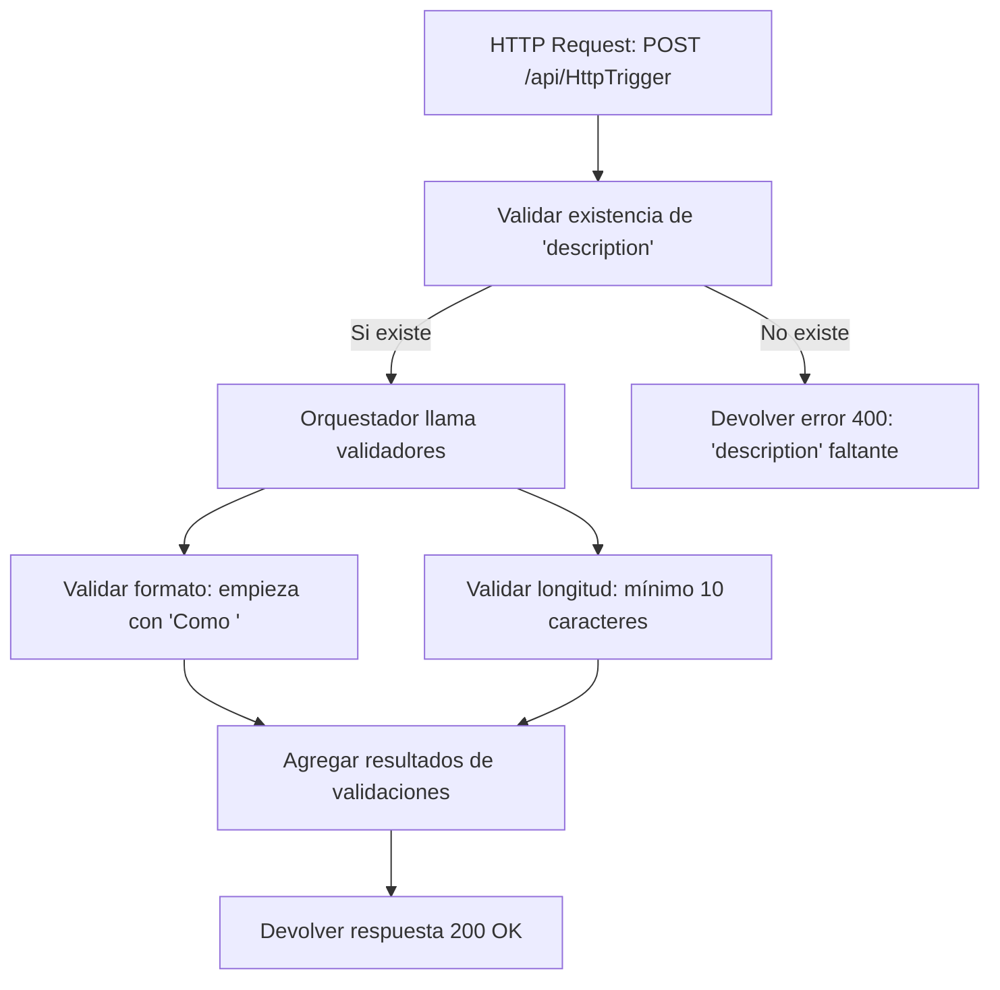

# 🚀 PoC Azure - Integración Jira Azure IA

Prueba de concepto para validar y desplegar funciones serverless en Azure Functions, utilizando GitHub Actions para CI/CD automático.

---

## 🛠️ Stack Tecnológico

- **Backend sin servidor**: Azure Functions (Plan de Consumo, Linux)
- **CI/CD automático**: GitHub Actions conectado a Azure para despliegue continuo.
- **Lenguaje**: Python 3.11
- **Framework**: Azure Functions Python Library
- **Logs**: Integrados con Application Insights.

---

## 📂 Estructura del Proyecto

```plaintext
jira_azure_poc_hu/
├── HttpTrigger/
│   ├── __init__.py         # Dispatcher de la Azure Function
│   ├── main.py             # Lógica principal del procesamiento HTTP
│   ├── orchestrator.py     # Orquestador de validaciones
│   ├── shared/             # Utilitarios compartidos (e.g., logger)
│   └── validators/         # Validadores individuales
│       ├── __init__.py
│       ├── format_validator.py
│       └── length_validator.py
├── requirements.txt        # Dependencias Python
├── host.json               # Configuración de host
├── local.settings.json     # Variables de entorno local
└── .github/workflows/
    └── main_jira-azure-validator.yml  # CI/CD GitHub Actions
```

---

## ✨ Funcionalidad Principal

- **Endpoint**: `POST /api/HttpTrigger`
- **Entrada esperada**:
```json
{
  "description": "Como usuario quiero registrarme rápidamente"
}
```
- **Validaciones actuales**:
  - Verificar que `description` comience con **"Como "**.
  - Verificar que `description` tenga **mínimo 10 caracteres**.
- **Respuesta ejemplo**:
```json
{
  "success": true,
  "message": "Request processed successfully.",
  "validation_results": {
    "format_validation": {
      "passed": true,
      "details": "Description starts correctly with 'Como '."
    },
    "length_validation": {
      "passed": true,
      "details": "Description length is sufficient (>= 10)."
    }
  },
  "data_received": {
    "description": "Como usuario quiero registrarme rápidamente"
  }
}
```

---

## 📈 Flujo de Procesamiento



---

## 🔧 Despliegue y CI/CD

Cada vez que haces `push` en la rama `main`:
- Se ejecuta automáticamente un **GitHub Action Workflow**.
- Se despliega directamente a la Azure Function configurada.

**Notas**:
- El entorno de ejecución en Azure Functions es **Linux** (plan gratuito de consumo).
- Para desarrollo local:
  - Visual Studio Code
  - Azure Functions Core Tools

El proyecto está diseñado para ser **escalable, robusto y preparado para validaciones futuras**.

---

## 📌 Futuras Mejoras

- Validar más campos de la historia de usuario (por ejemplo: criterios de aceptación).
- Integrar validaciones semánticas usando **Azure AI Services**.
- Integrar flujos directos de Jira a Azure mediante **webhooks**.
- Agregar validaciones condicionales basadas en tipo de historia.